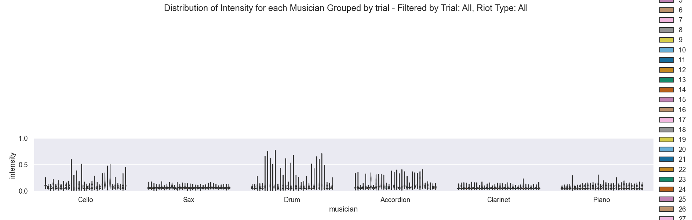
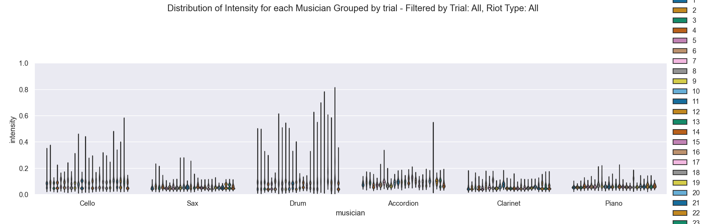
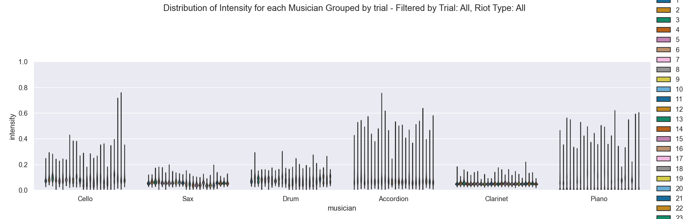

# Analyse DSYNC ISMM

## Notebooks

*Contain interactiv script to visualise data analysis*

install conda env :

`conda env create --name analyse_dsync --file=./conda/environments.yml` 

activate conda env :
`conda activate analyse_dsync`

make sure you have Jupyter notebook or kind of notebook installed, select **analyse_dsync** kernel and you're ready
 

